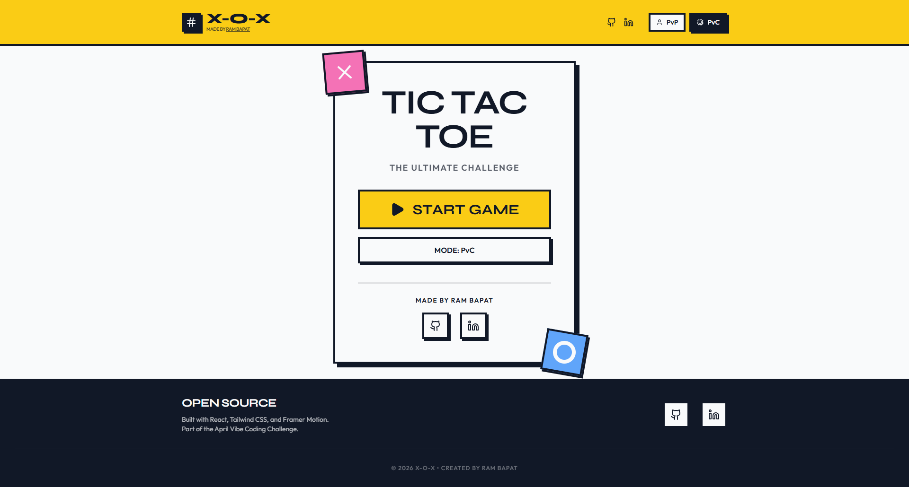
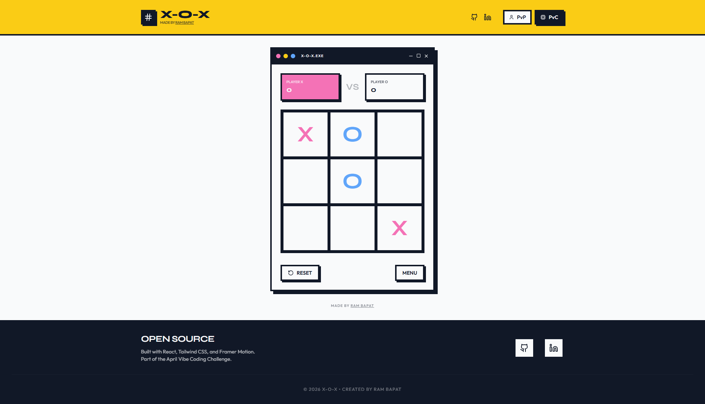
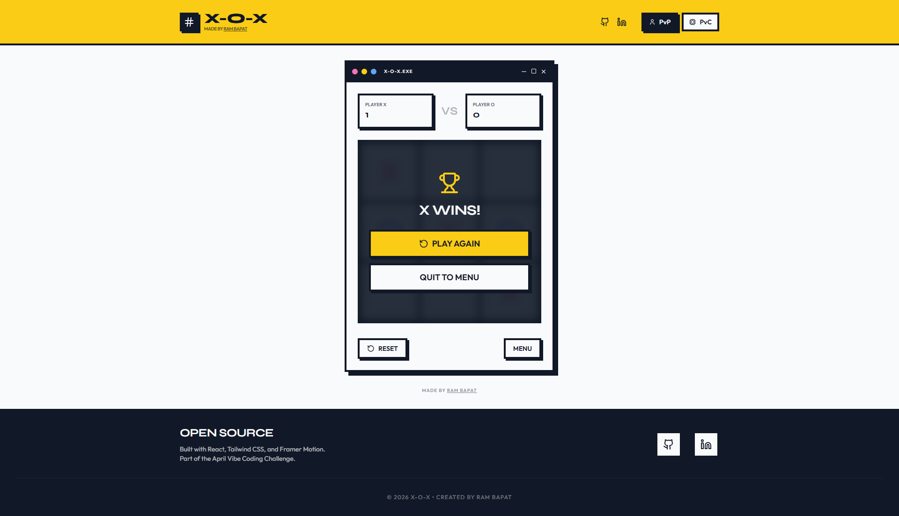

# ❌⭕ X-O-X: The Ultimate Tic-Tac-Toe

    

**Day 06 / 30 - April Vibe Coding Challenge**

## Try the live demo - [Demo](https://x-o-x-tic-tac-toe.vercel.app/)

**X-O-X** is a premium, high-performance Tic-Tac-Toe experience designed with a bold Neo-Brutalist aesthetic. 

Instead of a generic grid, X-O-X offers a tactile, high-contrast interface that feels like a physical board game. Whether you're playing against a friend or testing your skills against an unbeatable AI, every move is satisfyingly animated and visually striking.

Built with a "Neo-Brutalist" and "High-Contrast" aesthetic, it stands out with its sharp shadows, thick borders, and vibrant colors.

## Screenshots

 
 
 


## ✨ Features

*   **⚡ Unbeatable AI Engine:** Powered by the Minimax algorithm. The computer evaluates every possible move to ensure it never loses, providing the ultimate challenge for strategic players.
*   **👁️ Neo-Brutalist Workspace:** A beautifully engineered interface featuring bold typography, sharp 8px shadows, and a vibrant color palette (Neon Yellow, Pink, and Blue).
*   **📏 Dual Game Modes:** Switch seamlessly between Human vs Human (PvP) and Human vs Computer (PvC) modes.
*   **📦 Smooth Motion System:** Every "X" and "O" placement is animated with Framer Motion, providing a premium feel to a classic game.
*   **🎨 Responsive Windowed UI:** The game is housed in a "window" container that adapts perfectly to mobile, tablet, and desktop screens.

## 🛠️ Tech Stack

*   **Frontend Framework:** React 19 + Vite
*   **Styling:** Tailwind CSS 4 (Neo-Brutalist implementation)
*   **Animations:** Framer Motion (`motion/react`)
*   **Icons:** Lucide React
*   **AI Logic:** Minimax Algorithm

## 🚀 Getting Started

Running X-O-X locally is incredibly simple. No backend required!

### 1. Clone the Repository
```bash
git clone https://github.com/Barrsum/X-O-X-Tic-Tac-Toe.git
cd X-O-X-Tic-Tac-Toe
```

### 2. Install Dependencies
```bash
npm install
```

### 3. Run the App
```bash
npm run dev
```
The app will launch locally on `http://localhost:3000`. 

## 🛡️ Architecture Insights

*   **Minimax Logic:** The AI evaluates the game state recursively. It assigns scores (+10 for AI win, -10 for Human win, 0 for draw) and chooses the path that maximizes its minimum gain.
*   **State Management:** The game uses a centralized state for the board, current player, and winner info, ensuring reactive UI updates and smooth transitions between menu and gameplay.

## 👤 Author

**Ram Bapat**
*   [LinkedIn](https://www.linkedin.com/in/ram-bapat-barrsum-diamos)
*   [GitHub](https://github.com/Barrsum)

---
*Part of the April 2026 Vibe Coding Challenge.*
